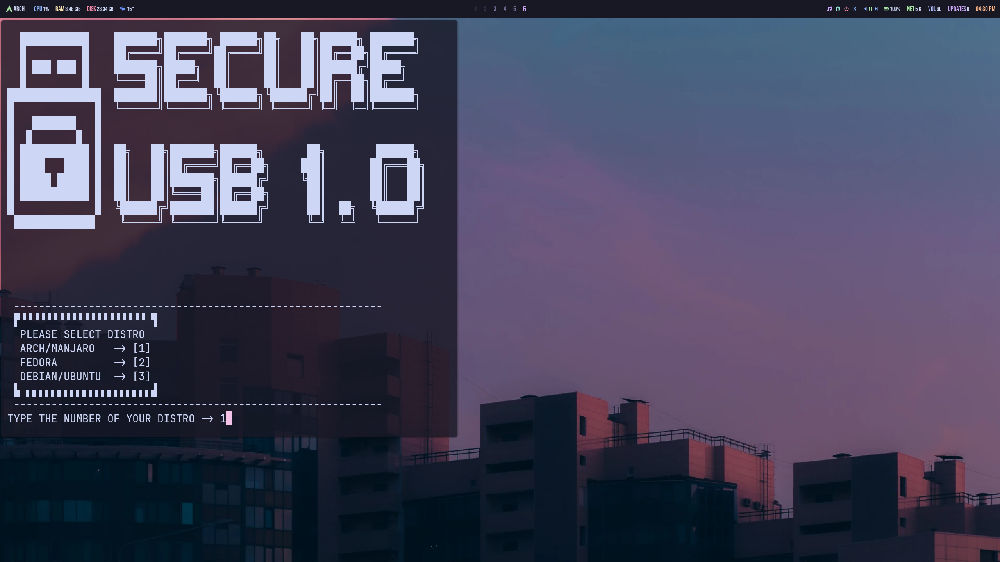

# USB-Secured Password Manager

A terminal-based password manager that locks your credentials inside an encrypted vault.  
Security comes from two layers:  
1. **LUKS-encrypted USB** that holds the secret key.  
2. **Fernet-encrypted vault** that stores your passwords.

---

## Security Features
- LUKS full-disk encryption on USB  
- USB unlock password  
- Fernet encryption of vault file  
- Unique Fernet key stored only on USB  
- Vault file permission hardened to `600`  
- Argon2 password hashing support / Soon 
- Clipboard copy for credentials (no echo)  
- Aliases (`usbon` / `usboff`) for secure mount/unmount  

---

## Requirements
- Python 3.8+  
- System tools: `cryptsetup`, `iptables`, `iproute2`, `xclip`, `systemd`, `sudo`  
- Python packages: `cryptography`, `pyperclip`, `argon2-cffi`

---
## Installation

```bash
chmod +x install.sh
./install.sh
```
Choose your Linux distro (Arch/Manjaro, Fedora, Debian/Ubuntu) and follow prompts.


    The installer will:

    Install required dependencies

    Set up an encrypted USB

    Generate and store a Fernet key on the USB

    Configure aliases for mounting/unmounting

Usage after installation

Mount the secure USB:
```bash
usbon
```
Start the password manager:
```bash
python3 main.py
```
Unmount the USB when done:
```bash
usboff
```
Do not unlpug the usb before you unmount it and lock it 

**Navigation:

    Arrow keys to move

    Enter to select

    Options: Add, View, Edit, Delete, Quit

How it Works

    Without the USB, the Fernet key is missing → vault cannot be opened.

    Without the LUKS password, the USB cannot be unlocked.

    Only your Linux user can read the vault (chmod 600).

    Clipboard use avoids typing sensitive strings.


    TODO:
    argon2 / bruteforce deffence
    clipboard countdown 


